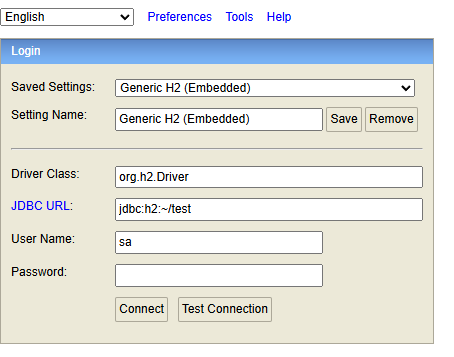

# H2 Database


### H2 데이터베이스란?

**정의**: 자바로 작성된 오픈소스 RDBMS. 별도 설치 없이 라이브러리(`jar`) 형태로 애플리케이션에 내장하여 사용 가능

<br>

**특징**

- **초경량**: 용량이 매우 작고(약 2.5MB)
- **빠른 속도**: 주로 인메모리(In-Memory) 방식으로 실행되어, 디스크 I/O 비용이 없기 때문에 쿼리 처리 속도가 빠름
- **다양한 모드 지원**:
    - **In-Memory Mode**: 데이터를 메모리에만 저장. 애플리케이션을 끄면 데이터가 모두 사라짐 (테스트용)
    - **Embedded Mode**: 애플리케이션 내부에 내장되어 로컬 파일에 데이터 저장
    - **Server Mode**: 별도의 DB 서버처럼 띄워서 여러 애플리케이션이 동시에 접속 가능

<br>

**주사용처**

- 테스트 환경
- 소규모 프로젝트

<br>
<br>

### H2 테이블

**정의**: H2는 일반적인 RDBMS처럼 테이블 구조를 가짐

<br>

**Spring Boot 환경에서 H2 테이블 생성법**

**1. JPA 자동 생성**
- `@Entity`를 붙여 클래스를 만들면, 애플리케이션 실행 시 H2에 자동으로 테이블을 생성해줌 (`ddl-auto: create` 설정 시)

**2. SQL 스크립트 (**`schema.sql`**)**
- 직접 쿼리를 작성하여 테이블을 만듦

<br>
<br>

### schema.sql

**정의**: 스프링 부트가 애플리케이션을 시작할 때, DB 구조를 만들기 위해 실행하는 SQL 파일

<br>

**위치**: `src/main/resources/schema.sql` (해당 위치에 있으면, 스프링 부트가 자동으로 찾아서 실행)

**역할**: 주로 테이블 생성(DDL) 쿼리

<br>

**주의점 (실행 순서)**

- 기본적으로 `schema.sql`이 JPA의 자동 생성보다 먼저 실행됨
- `schema.sql`과 JPA의 `ddl-auto` 기능을 동시에 쓰면 충돌 가능성 있음
    - → `schema.sql` 사용 시, JPA 자동 생성을 끔

<br>
<br>

### H2 Console

**정의**: 웹 브라우저에서 H2 DB에 접속하여 관리하고 SQL을 실행할 수 있는 GUI

- **접속 주소**: `http://localhost:8080/h2-console`



*<H2 Console 접속창>*

<br>
<br>

### H2 Console 접속 URL 고정하기

- **jdbc url**을 지정해주지 않으면, 서버 시작 시마다 **동적으로 생성됨**. 실행 정보에서 확인 가능


*<동적 jdbc URL>*

<br>

**접속 URL 고정하는 법**:

```yaml
# jdbc url 지정법 (application.yaml)

spring:
  datasource:
    url: **jdbc:h2:mem:testdb**  # JDBC URL을 `jdbc:h2:mem:testdb`로 설정
```

>[!TIP]
> - H2 콘솔의 데이터는 서버를 재시작할 때마다 새로고침